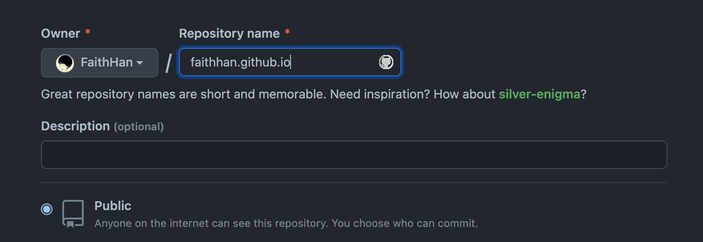
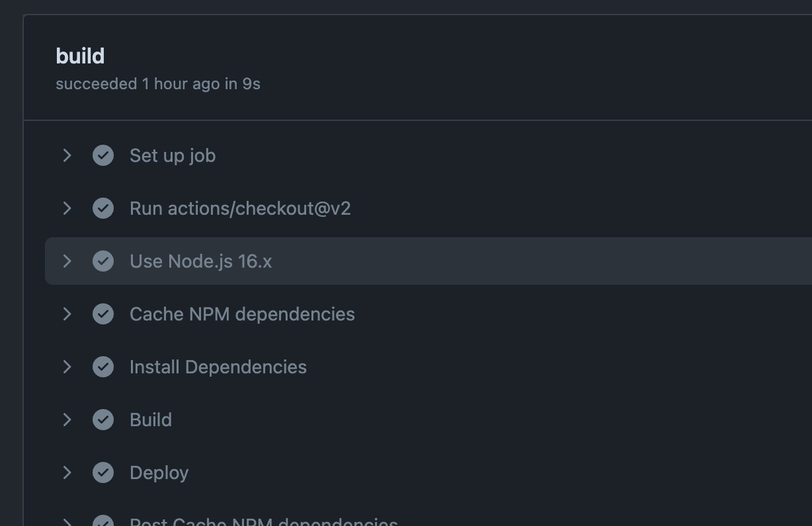
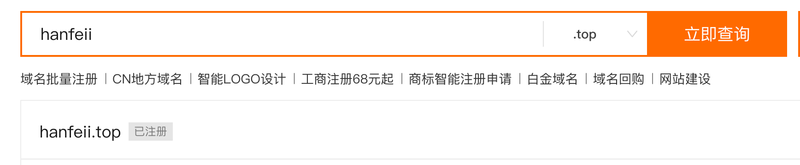
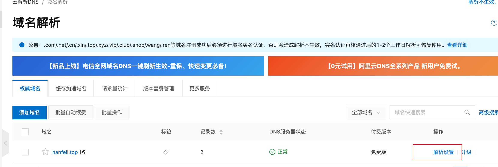
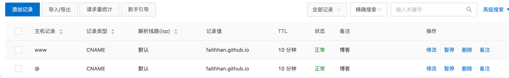
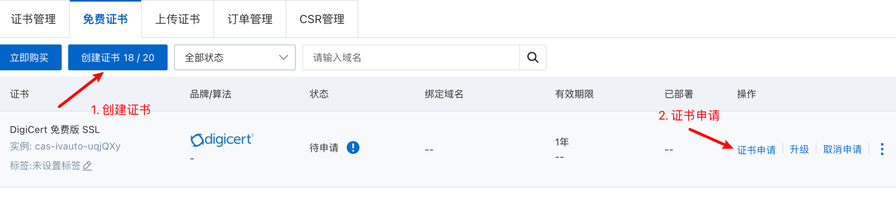
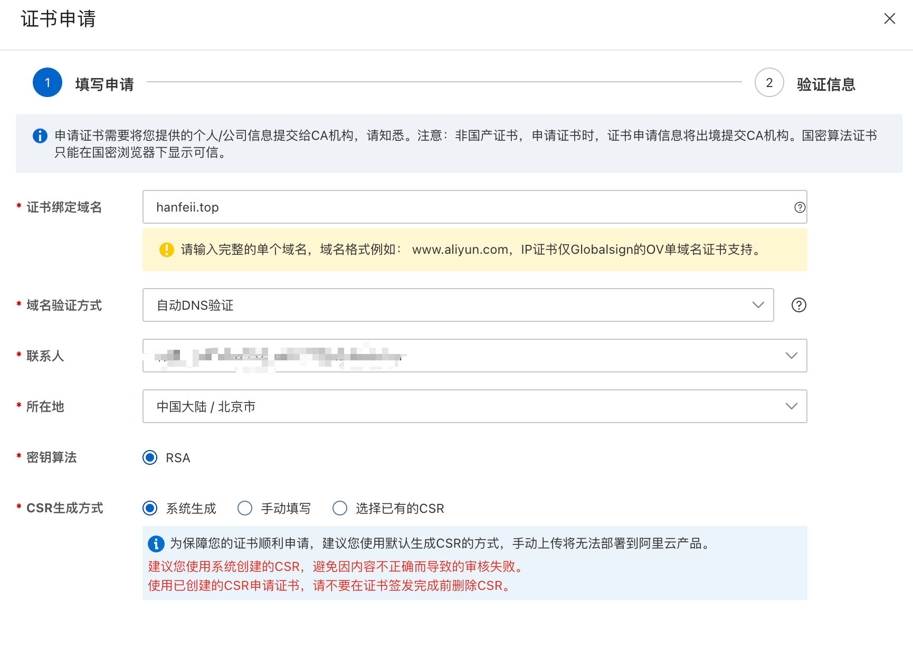
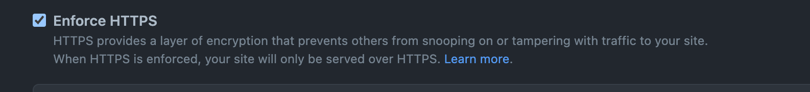

# Hexo简介

一个快速、简洁且高效的博客框架，使用[MARKDOWN](https://daringfireball.net/projects/markdown/syntax)引擎解析文章，在几秒内，即可利用靓丽的主题生成静态网页。

# Hexo安装

## 环境准备

* [Node.js](http://nodejs.org/)

* [Git](http://git-scm.com/)


## 安装

```shell
$ npm install -g hexo-cli
```


## Node.js版本限制

| Hexo 版本   | 最低兼容 Node.js 版本 |
| :---------- | :-------------------- |
| 6.0+        | 12.13.0               |
| 5.0+        | 10.13.0               |
| 4.1 - 4.2   | 8.10                  |
| 4.0         | 8.6                   |
| 3.3 - 3.9   | 6.9                   |
| 3.2 - 3.3   | 0.12                  |
| 3.0 - 3.1   | 0.10 or iojs          |
| 0.0.1 - 2.8 | 0.10                  |

# 如何建站：

## 搭建Hexo脚手架

```shell
$ hexo init <folder>
$ cd <folder>
$ npm install
```

## 新建博客

```shell
hexo new <blog name>
```

## 展示博客

```shell
hexo server
```


> Hexo具体使用细节请参考[中文官方文档](https://hexo.io/zh-cn/docs/)

# 托管到[GitHub Pages](https://pages.github.com/)


## 1. 新建Repo

在GitHub上新建一个Repo，并且名称命名为username.github.io



## 2. 将本地代码库关联并Push到远程Repo

```shell
$ git remote add origin git@github.com:FaithHan/faithhan.github..git
$ git push
```

# GitHub Actions实现自动部署

每次修改完博客后都需要重新生成静态文件并部署，我们可以利用GitHub Actions实现自动化，只要将代码push到远端就能自动部署，真正实现"所写即所得"。

我们需要在.github/workflows路径下新建deploy.yml文件，并Push到Repo中

```yaml
name: GitHub Pages

on:
  push:
    branches:
      - main
  pull_request:

jobs:
  deploy:
    runs-on: ubuntu-20.04
    concurrency:
      group: ${{ github.workflow }}-${{ github.ref }}
      cancel-in-progress: true
    steps:
      - name: checkout Repo
        uses: actions/checkout@v2

      - name: Setup Node
        uses: actions/setup-node@v2
        with:
          node-version: '16'

      - name: Cache dependencies
        uses: actions/cache@v2
        with:
          path: ~/.npm
          key: ${{ runner.os }}-node-${{ hashFiles('**/package-lock.json') }}
          restore-keys: |
            ${{ runner.os }}-node-

      - name: Install Dependencies
        run: npm ci

      - name: Build
        run: npm run build

      - name: Deploy
        uses: peaceiris/actions-gh-pages@v3
        if: ${{ github.ref == 'refs/heads/main' }}
        with:
          deploy_key: ${{ secrets.ACTIONS_DEPLOY_KEY }}
          publish_dir: ./public
          publish_branch: master
          external_repository: faithhan/faithhan.github.io
          user_name: hanfei
          user_email: freepuresakura@gmail.com
          cname: hanfeii.top
```

每次master提交后，就会自动触发流水线，生成静态文件并部署到博客Repo


​	

# 自定义博客域名

GitHub Pages默认的博客域名是**username.github.io**,我们可以为其绑定自定义的域名，本人采用阿里云。

### 1. 购买域名

在[阿里云域名中心](https://wanwang.aliyun.com/domain/searchresult/#/?keyword=hanfeii&suffix=top)购买域名（需要填写个人信息并实名认证,审核过后即可使用）




### 2. 解析设置

在控制台打开自己想要配置的域名，进行解析配置



添加两条解析配置到github博客域名



### 3. CNAME文件

在source文件夹中新建CNAME文件（在source中新建CNAME可以防止每次部署文件被覆盖），填写自定义博客域名并提交，待生效后即可从自定义域名中访问博客

# 添加Https证书

默认的自定义域名是不带Https的，为了能够在浏览器地址栏里看到小锁头，我们还要做接下来的配置

### 1. 利用阿里云SSL证书

这里我们可以利用[阿里云数字证书管理服务](https://yundun.console.aliyun.com/?spm=5176.12818093.ProductAndService--ali--widget-home-product-recent.dre0.5adc16d0fjTJAK&p=cas#/certExtend/free)购买免费的SSL证书，购买完毕后点击创建证书会生成一个新的证书，之后点击证书申请，为我们新建的证书做一些配置。



将证书绑定到自己的域名下，并填写相关信息，审核生效后即可。



到这一步我们已经可以通过Https协议正常访问我们的自定义博客站点了。

### 2.  开启强制Https访问

如果我们想强制走Https访问，需要在GitHub里做些配置，只需要勾选设置中Enforce HTTPS 这个选项即可



> 如果Https不生效，我们可以先把自定义域名去除，生效后重新加回来即可
