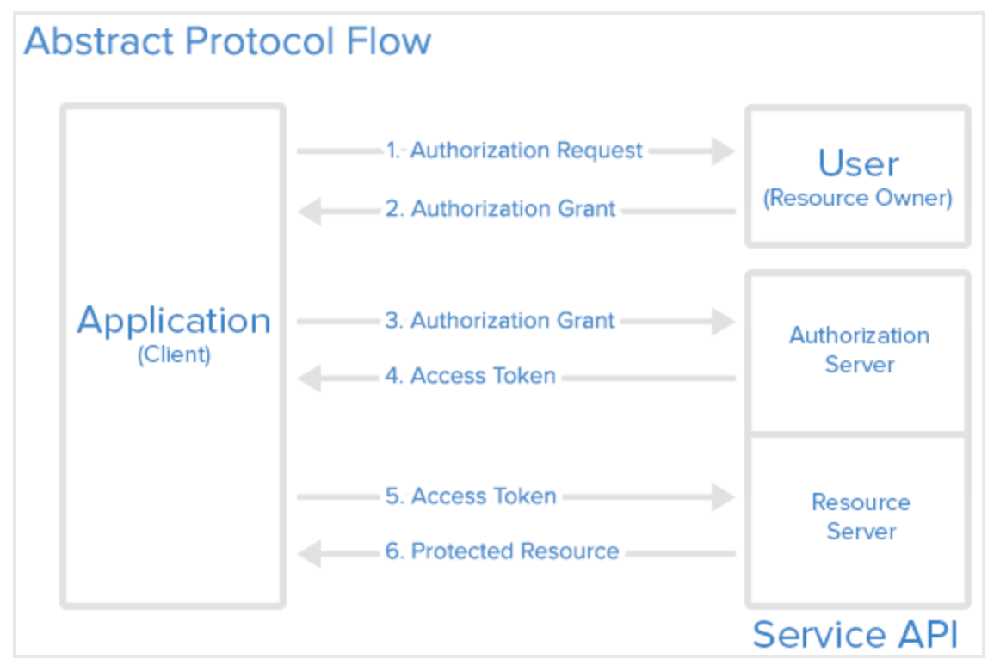
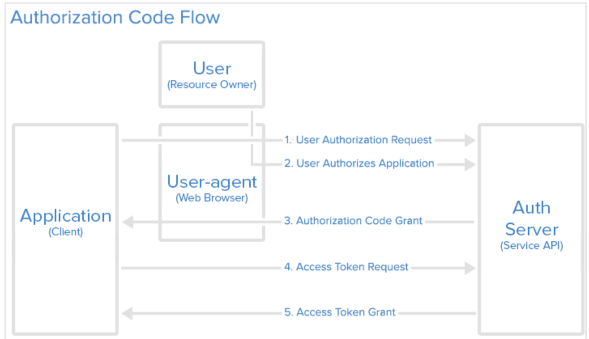

# 什么是OAuth2

Oauth2是一个授权的开放标准，能够使第三方应用程序获得对HTTP服务上用户账户的有权限访问，并且不需要将用户名和密码提供给三方应用。它可以为Web，桌面和移动应用程序提供授权流程。

# OAuth2名词解释

* **Resource Owner**： 资源持有者，即用户
* **Client**： 用户客户端，可以是浏览器、桌面应用，移动应用
* **Resource Server**: 资源服务器，
* **Authorization server**: 认证服务器
* **Third-party application**: 第三方应用
* **HTTP service**：HTTP服务提供商

# 运行流程

> 1. 应用程序向用户发起授权
> 2. 如果用户同意，则客户端获得授权
> 3. 用上一步获得的授权（通常为授权code），请求授权服务器获取Access Token
> 4. 授权服务器返回Access Token
> 5. 携带Access Token请求资源服务器
> 6. 资源服务器验证通过Access Token后，返回客户端所请求的资源

# 授权模式

* 授权码模式（authorization code）

* 简化模式（implicit）

* 密码模式（resource owner password credentials）

* 客户端模式（client credentials）

其中，授权码模式是最为完整和严谨的模式，它对服务端应用程序做了优化，可以维护client secret的安全性，目前大多数网站的OAuth2实现也基于此种模式。

# 授权码模式

这是它工作的大概流程：

1. 用户点击Code申请链接
2. 用户同意授权
3. 应用程序收到授权Code
4. 应用程序携带请求Access Token
5. 应用程序获得Access Token

# 有用的参考

* https://oauth.net/2/

* [https://www.digitalocean.com/community/tutorials/an-introduction-to-oauth-2](https://www.digitalocean.com/community/tutorials/an-introduction-to-oauth-2)

* https://zhuanlan.zhihu.com/p/84670338
